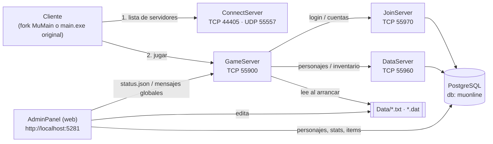

# SharpSSeMU-099B

🌐 [English](README.md) · **Español**

MU Online **0.99B**, en dos proyectos cuyos nombres dicen de dónde vienen:

| Proyecto | Basado en | Qué es |
|---|---|---|
| **[SharpSSeMU](SharpSSeMU/)** | **SSeMU** 2.1.7 (emulador C++, SetecSoft) | Una **reimplementación desde cero, en C#/.NET 10, del servidor SSeMU 0.99B** ("Sharp" = C#) |
| **[MuMain-099B](MuMain-099B/)** | **[MuMain](https://github.com/sven-n/MuMain)** (sven-n) | Un **fork del cliente open source MuMain**, portado para hablar exactamente el protocolo 0.99B ("099B" = el protocolo al que apunta) |

Juntos permiten correr y jugar un servidor privado 0.99B completo en tu propia máquina — y leer,
entender y extender cada pieza.

> **Estado: en desarrollo, jugable.** Podés iniciar sesión, crear un personaje, recorrer el mundo,
> pelear contra monstruos con las fórmulas reales de daño, subir de nivel, usar items, joyas,
> tiendas, la Chaos Machine y Devil Square. Todavía faltan varios sistemas: la lista honesta y
> detallada está en [`docs/es/STATUS.md`](docs/es/STATUS.md).
>
> Los nombres internos del código (proyectos/namespaces `MuServer.*`) se mantienen del port original;
> solo cambiaron los nombres de proyecto y de carpeta.

---

## Qué hay en este repositorio

| Carpeta | Qué es | Lenguaje |
|---|---|---|
| [`SharpSSeMU/`](SharpSSeMU/) | El servidor, basado en SSeMU: ConnectServer, JoinServer, DataServer, GameServer, un **AdminPanel** web, el esquema de PostgreSQL y tests end-to-end | C# / .NET 10 |
| [`MuMain-099B/`](MuMain-099B/) | El cliente, basado en MuMain: fork de [sven-n/MuMain](https://github.com/sven-n/MuMain) con la capa de red portada a 0.99B, una librería de protocolo generada desde las fuentes originales y 152 tests unitarios | C++ / CMake (+ una pequeña librería C# AOT) |
| [`docs/`](docs/) | Puesta en marcha, compilación, arquitectura y estado/roadmap (inglés + español) | Markdown |
| [`scripts/`](scripts/) | Scripts auxiliares (bajar dependencias de terceros con versión fija) | PowerShell / Bash |

**No incluido** (los ponés vos; ver [NOTICE.md](NOTICE.md)): el cliente original del juego
(`MuClient/`), el paquete original del servidor SSeMU (`MuServer99B/`, que aporta las tablas
`Data/` que carga el servidor) y las fuentes C++ del emulador SSeMU (`Source/`, la referencia contra
la que se verifica el port). Están en `.gitignore` para que puedas dejarlas junto a las carpetas del repo.

## Cómo encajan las piezas



El protocolo coincide byte a byte con el original: cliente y servidor **no** hablan un dialecto
propio. Los structs de paquetes del cliente se *generan* desde las fuentes del emulador
(`MuMain-099B/tools/protogen`), nunca se transcriben a mano, y cada struct lleva
`static_assert` de tamaño y offsets. Ver [`docs/es/ARCHITECTURE.md`](docs/es/ARCHITECTURE.md).

## Inicio rápido (Windows, ~10 minutos)

Instrucciones completas: **[`docs/es/GETTING_STARTED.md`](docs/es/GETTING_STARTED.md)**. En resumen:

```powershell
# 0. Requisitos: .NET 10 SDK, PostgreSQL 16, Python 3.10+ y el paquete original del juego
#    (MuClient/ y MuServer99B/) junto a SharpSSeMU/ -- ver docs/es/GETTING_STARTED.md

# 1. Base de datos
psql -U postgres -c "CREATE USER muserver WITH PASSWORD 'muserver';"
createdb -U postgres -O muserver muonline
foreach ($f in '001_accounts','002_characters','003_default_class_seed','004_friends') {
  psql -U muserver -d muonline -f "SharpSSeMU/db/postgres/$f.sql"
}

# 2. Compilar el servidor y desplegar su config + datos del juego junto a los binarios
dotnet build SharpSSeMU/SharpSSeMU.sln
python SharpSSeMU/deploy_configs.py

# 3. Levantar ConnectServer, JoinServer, DataServer y GameServer
SharpSSeMU\start_servers.bat

# 4. (opcional) panel de administración -> http://localhost:5281
cd SharpSSeMU/src/MuServer.AdminPanel; dotnet run
```

Después abrí un cliente apuntando a `127.0.0.1:44405` e iniciá sesión con la cuenta de prueba
(`test` / `test`). Cómo compilar el cliente: [`docs/es/BUILDING.md`](docs/es/BUILDING.md).

> ⚠️ Las cuentas sembradas (`test`, `admin`) y la contraseña por defecto de la base son solo para
> desarrollo local. Cambialas antes de exponer algo a una red.

## Lo más destacado

**Servidor**
- ConnectServer / JoinServer / DataServer / GameServer portados y probados de punta a punta contra un PostgreSQL real.
- Datos reales del juego: 231 tipos de monstruo, ~2 900 monstruos en 15 mapas, 349 items, 58 skills, tiendas de NPC — cargados desde las tablas `Data/` originales.
- Combate portado del `Attack.cpp` original: tirada de acierto/esquiva, defensa (a la mitad contra jugadores), pisos de daño, ataques físicos y mágicos de monstruos.
- Stats de personaje, items e inventario, items de piso, joyas (Bless/Soul/Life), Chaos Machine con las fórmulas reales, Devil Square, party/amigos/chat, baúl y trade.
- **AdminPanel**: interfaz web (Blazor Server + MudBlazor) para editar tasas, items, monstruos, spawns, tiendas, skills, puertas, quests, eventos y todos los `GameServerInfo - *.dat`, ver/editar personajes con un selector de items con búsqueda, y ver el estado del servidor en vivo.
- Se cargan los 8 archivos de configuración `GameServerInfo - *.dat`.

**Cliente**
- Capa de red 0.99B completa: 3 capas de cifrado, framing, todos los paquetes servidor→cliente atendidos y 57 de los 59 opcodes cliente→servidor.
- Librería de protocolo generada desde el código del emulador con verificación de layout en compilación; 152 tests unitarios.
- Herramientas para auditar el cliente contra el servidor (`tools/protogen/audit_*.py`, `tools/probe099b`).

## Documentación

| Documento | Contenido |
|---|---|
| [`docs/es/GETTING_STARTED.md`](docs/es/GETTING_STARTED.md) | Requisitos, archivos del juego, base de datos, configuración y ejecución, conectar un cliente, problemas comunes |
| [`docs/es/BUILDING.md`](docs/es/BUILDING.md) | Compilar servidor y cliente, correr los tests |
| [`docs/es/ARCHITECTURE.md`](docs/es/ARCHITECTURE.md) | Componentes, puertos, flujo de datos, capas de protocolo/cifrado, cómo se verifica el port |
| [`docs/es/STATUS.md`](docs/es/STATUS.md) | Qué anda, qué es parcial, qué falta, roadmap, limitaciones conocidas |
| [`SharpSSeMU/README.md`](SharpSSeMU/README.md) | Referencia del servidor *(inglés)*: módulos, configuración, AdminPanel, estructura del código |
| [`MuMain-099B/docs/protocolo-099b.es.md`](MuMain-099B/docs/protocolo-099b.es.md) | Análisis a fondo del port del protocolo: las trampas, los arreglos, las herramientas de auditoría |
| [`SharpSSeMU/docs/development-log.es.md`](SharpSSeMU/docs/development-log.es.md) | Diario cronológico completo del servidor |
| [`CONTRIBUTING.md`](CONTRIBUTING.md) | Cómo contribuir (incluye resumen en español) |

## Contribuir

Se agradecen las contribuciones — sobre todo la **interfaz del cliente** (el protocolo ya habla
0.99B pero la UI sigue con aspecto de Season 6; ver `docs/ui-099b.md` del cliente), los sistemas
que faltan en el servidor ([`docs/es/STATUS.md`](docs/es/STATUS.md)) y reportes de pruebas con
cliente real. Leé antes [`CONTRIBUTING.md`](CONTRIBUTING.md).

## Legal

Proyecto independiente, sin fines de lucro, de aficionados y educativo. **No está afiliado ni
respaldado por Webzen** ni por los autores de SSeMU, y **no incluye assets del juego**. "MU Online"
pertenece a sus respectivos dueños. Leé [`NOTICE.md`](NOTICE.md) antes de redistribuir algo, y tené
en cuenta que el código original es **MIT** ([`LICENSE`](LICENSE)); las partes derivadas de terceros quedan excluidas (ver la sección *License* de ese archivo).

## Créditos

- Los autores del emulador **SSeMU** (SetecSoft) — la implementación de referencia de la que este servidor es un port.
- **sven-n / MUnique** — [MuMain](https://github.com/sven-n/MuMain) (base del cliente) y [OpenMU](https://github.com/MUnique/OpenMU), el proyecto de servidor C# de referencia.
- **Louis**, **Qubit**, **Nitoy** y la comunidad de RaGEZONE / tuservermu.com.ve por el trabajo de cliente sobre el que se apoya MuMain.
- [SDL](https://libsdl.org), [Dear ImGui](https://github.com/ocornut/imgui), [MudBlazor](https://mudblazor.com), [Npgsql](https://www.npgsql.org).
