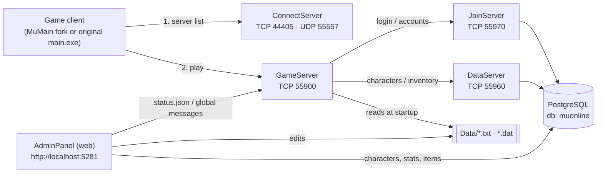

# SharpSSeMU-099B

🌐 **English** · [Español](README.es.md)

MU Online **0.99B**, in two projects that name their origin:

| Project | Based on | What it is |
|---|---|---|
| **[SharpSSeMU](SharpSSeMU/)** | **SSeMU** 2.1.7 (C++ emulator, SetecSoft) | A from-scratch **C#/.NET 10 re-implementation of the SSeMU 0.99B server** ("Sharp" = C#) |
| **[MuMain-099B](MuMain-099B/)** | **[MuMain](https://github.com/sven-n/MuMain)** (sven-n) | A **fork of the open-source MuMain client**, ported to speak the exact 0.99B wire protocol ("099B" = the protocol it targets) |

Together they let you run and play a complete 0.99B private server on your own machine — and read,
understand and extend every piece of it.

> **Status: work in progress, playable.** You can log in, create a character, walk the world,
> fight monsters with the real damage formulas, level up, use items, jewels, shops, the Chaos
> Machine and Devil Square. Several systems are still missing — see [`docs/STATUS.md`](docs/STATUS.md)
> for the honest, detailed list.
>
> Internal code names (`MuServer.*` projects/namespaces) are kept from the original port; only the
> project and folder names changed.

---

## What is in this repository

| Folder | What it is | Language |
|---|---|---|
| [`SharpSSeMU/`](SharpSSeMU/) | The server, based on SSeMU: ConnectServer, JoinServer, DataServer, GameServer, a web **AdminPanel**, PostgreSQL schema and end-to-end tests | C# / .NET 10 |
| [`MuMain-099B/`](MuMain-099B/) | The client, based on MuMain: a fork of [sven-n/MuMain](https://github.com/sven-n/MuMain) whose network layer was ported to 0.99B, with a generated-from-source protocol library and 152 unit tests | C++ / CMake (+ a small C# AOT library) |
| [`docs/`](docs/) | Getting started, build guide, architecture, status/roadmap (English + Spanish) | Markdown |
| [`scripts/`](scripts/) | Helper scripts (fetching pinned third-party sources) | PowerShell / Bash |

**Not included** (you supply them; see [NOTICE.md](NOTICE.md)): the original game client
(`MuClient/`), the original SSeMU server package (`MuServer99B/` — provides the `Data/` tables the
game server loads) and the SSeMU C++ emulator sources (`Source/`, used as the reference the port is
verified against). They are git-ignored so you can drop them next to the repo folders.

## How the pieces fit



The protocol is a byte-for-byte match of the original: the client and server are **not** using a
custom dialect. The client's packet structs are *generated* from the original emulator sources
(`MuMain-099B/tools/protogen`), never transcribed by hand, and every struct carries
`static_assert` size/offset checks. See [`docs/ARCHITECTURE.md`](docs/ARCHITECTURE.md).

## Quick start (Windows, ~10 minutes)

Full instructions: **[`docs/GETTING_STARTED.md`](docs/GETTING_STARTED.md)**. In short:

```powershell
# 0. Prerequisites: .NET 10 SDK, PostgreSQL 16, Python 3.10+, and the original game package
#    (MuClient/ and MuServer99B/) placed next to SharpSSeMU/ -- see docs/GETTING_STARTED.md

# 1. Database
psql -U postgres -c "CREATE USER muserver WITH PASSWORD 'muserver';"
createdb -U postgres -O muserver muonline
foreach ($f in '001_accounts','002_characters','003_default_class_seed','004_friends') {
  psql -U muserver -d muonline -f "SharpSSeMU/db/postgres/$f.sql"
}

# 2. Build the server and deploy its config + game data next to the binaries
dotnet build SharpSSeMU/SharpSSeMU.sln
python SharpSSeMU/deploy_configs.py

# 3. Start ConnectServer, JoinServer, DataServer and GameServer
SharpSSeMU\start_servers.bat

# 4. (optional) admin panel -> http://localhost:5281
cd SharpSSeMU/src/MuServer.AdminPanel; dotnet run
```

Then start a client pointed at `127.0.0.1:44405` and log in with the seeded test account
(`test` / `test`). Building the client is covered in [`docs/BUILDING.md`](docs/BUILDING.md).

> ⚠️ The seeded accounts (`test`, `admin`) and the default database password exist for local
> development only. Change them before exposing anything to a network.

## Highlights

**Server**
- ConnectServer / JoinServer / DataServer / GameServer ported and tested end-to-end against a real PostgreSQL.
- Real game data: 231 monster types, ~2 900 spawned monsters across 15 maps, 349 items, 58 skills, NPC shops — loaded from the original `Data/` tables.
- Combat ported from the original `Attack.cpp`: hit/dodge roll, defense (halved against players), damage floors, physical and magical monster attacks.
- Character stats, items and inventory, ground items, jewels (Bless/Soul/Life), Chaos Machine with the real mix formulas, Devil Square, party/friends/chat, warehouse and trade.
- **AdminPanel**: a web UI (Blazor Server + MudBlazor) to edit rates, items, monsters, spawns, shops, skills, gates, quests, events and all `GameServerInfo - *.dat` files, browse/edit characters with a searchable item picker, and see live server status.
- All 8 `GameServerInfo - *.dat` configuration files are loaded.

**Client**
- Complete 0.99B network layer: 3 encryption layers, framing, every server→client packet handled and 57 of the 59 client→server opcodes.
- Protocol library generated from the emulator source with compile-time layout checks; 152 unit tests.
- Tooling to audit the client against the server (`tools/protogen/audit_*.py`, `tools/probe099b`).

## Documentation

| Document | Contents |
|---|---|
| [`docs/GETTING_STARTED.md`](docs/GETTING_STARTED.md) | Prerequisites, bringing your own game files, database, configuring and running everything, connecting a client, troubleshooting |
| [`docs/BUILDING.md`](docs/BUILDING.md) | Building the server and the client, running the test suites |
| [`docs/ARCHITECTURE.md`](docs/ARCHITECTURE.md) | Components, ports, data flow, protocol/crypto layers, how the port is verified |
| [`docs/STATUS.md`](docs/STATUS.md) | What works, what is partial, what is missing, roadmap, known limitations |
| [`SharpSSeMU/README.md`](SharpSSeMU/README.md) | Server reference: modules, configuration, AdminPanel, code layout |
| [`MuMain-099B/docs/protocol-099b.md`](MuMain-099B/docs/protocol-099b.md) | Deep dive into the protocol port: the pitfalls, the fixes, the audit tools |
| [`SharpSSeMU/docs/development-log.md`](SharpSSeMU/docs/development-log.md) | The full chronological development log of the server |
| [`CONTRIBUTING.md`](CONTRIBUTING.md) | How to contribute |

Spanish versions of the main guides live in [`docs/es/`](docs/es/).

## Contributing

Contributions are welcome — especially the **client UI** (the protocol speaks 0.99B but the
interface still looks like Season 6; see the client's `docs/ui-099b.md`), the missing server
systems in [`docs/STATUS.md`](docs/STATUS.md), and real-client testing reports. Please read
[`CONTRIBUTING.md`](CONTRIBUTING.md) first.

## Legal

This is an independent, non-commercial fan/educational project. It is **not affiliated with or
endorsed by Webzen** or the SSeMU authors, and it ships **no game assets**. "MU Online" belongs to
its respective owners. Read [`NOTICE.md`](NOTICE.md) before redistributing anything, and note that
the original code is **MIT-licensed** ([`LICENSE`](LICENSE)); upstream-derived and third-party parts are excluded (see the *License* section of that file).

## Credits

- The **SSeMU** emulator authors (SetecSoft) — the reference implementation this server is a port of.
- **sven-n / MUnique** — [MuMain](https://github.com/sven-n/MuMain) (the client base) and [OpenMU](https://github.com/MUnique/OpenMU), the reference C# server project.
- **Louis**, **Qubit**, **Nitoy** and the RaGEZONE / tuservermu.com.ve community for the client work MuMain builds on.
- [SDL](https://libsdl.org), [Dear ImGui](https://github.com/ocornut/imgui), [MudBlazor](https://mudblazor.com), [Npgsql](https://www.npgsql.org).
